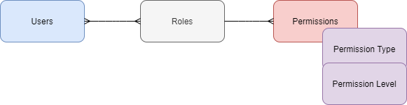
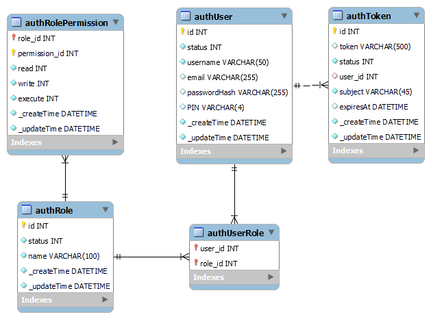

# Kalmia Auth API architecture


In general, the Auth module follows the RBAC philosophy.
Three main entities are involved in the system:
* Users - All the users of the system. Example: Jonny Novak is a user.
* Roles - Different roles that can be correlated to users. Example: Accountant, Administrator, Transport Manager, Behind the belt worker, ....  
* Role permissions - Roles posses different permissions, as well as different types (read, write, execute) and levels (none, own, all) within those permissions. Types and levels can be found in [types.ts](src/config/types.ts), in `PermissionType` and `PermissionLevel`, respectively.



All the data and relations are stored in the relational database. On the selected resources (usually endpoint) the needed permission and access levels must be set.
Example: The API level order delete will need permission `Permission.ORDER`, and the needed type `PermissionType.WRITE`.

A user in the role Administrator will have a role with the permission `Permission.ORDER` and type `PermissionType.WRITE`, which will allow delete on the above resource.

On the API the following method is called, to check for permissions (includes read check):
```typescript
await auth.canAccess(123, [
  {
    permission: Permission.ORDER,
    type: PermissionType.WRITE,
    level: PermissionLevel.ALL
  }
]);
```
where the first argument is the `userId` and the second argument is the needed `PermissionPass` objects.

Check the [usage](/docs/USAGE.md) for more usage details.

## Access control structure
Users have roles, roles can have a permissions with specific access attributes.

A route should define what actions (CRUD) are allowed on a resource. A database entry defines what permissions, types and levels are needed for certain actions on a resource.

Roles and role permissions are entered in the following way:
```typescript
const role = await auth.createRole('MY_ROLE');
const success = await auth.addPermissionsToRole(role.id, [
  {
    permission_id: Permission.NOTIFICATION_SETTINGS,
    name: Permission[Permission.NOTIFICATION_SETTINGS]
    read: PermissionLevel.OWN,
    write: PermissionLevel.OWN,
    execute: PermissionLevel.NONE,
  }
])
```
This would create a role called `MY_ROLE` and assign it the permission `Permission.NOTIFICATION_SETTINGS`, with read and write levels of `PermissionLevel.OWN`.

## Database structure
